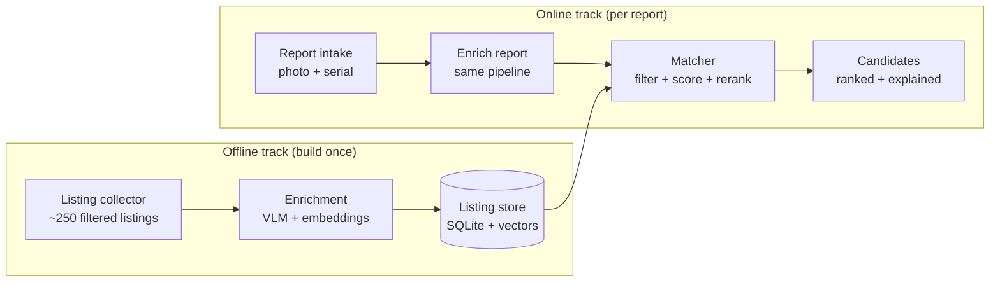

# Stolen Bike Matcher — Hackathon Prototype Spec

> **For Cursor:** This file is the single source of truth for the project. Read it fully before generating code. Follow the repo layout, data model, and API exactly. Build in the order given in the Task Checklist. Keep code simple, typed, and demo-ready — this is a 1-day prototype, not production.

---

## 1. Product summary

A user reports their stolen bike (photos + serial number + theft date/location). The app compares the report against a **pre-collected, pre-enriched dataset of ~200–300 second-hand bike listings** (Marktplaats) and returns a ranked list of candidate listings with human-readable reasons.

**Important constraints**
- **No live scraping.** Listings are collected once, via targeted search queries, and stored locally.
- Every report is matched against this fixed dataset.
- Outputs are *candidates for police review*, never accusations.

---

## 2. Architecture



Key principle: **reports and listings go through the exact same enrichment code**, so their attributes and embeddings are directly comparable.

---

## 3. Tech stack

| Concern | Choice |
|---|---|
| Language | Python 3.11+ |
| Backend | FastAPI + Pydantic |
| Database | SQLite (`data/bike.db`) |
| Vector search | FAISS or `sqlite-vec` |
| Image embeddings | `open_clip` (CLIP / SigLIP) |
| Attribute extraction + rerank | Vision LLM (Claude or GPT) via API |
| OCR (serials) | VLM or `easyocr` |
| Frontend | Streamlit (fastest); Next.js only if the team is fluent |

### Environment variables (`.env`)
```
ANTHROPIC_API_KEY=...        # or OPENAI_API_KEY
VLM_MODEL=...                # vision-capable model name
CLIP_MODEL=ViT-B-32
DB_PATH=data/bike.db
API_URL=http://localhost:8000
```

---

## 4. Repository layout

```
bike-matcher/
├── data/
│   ├── raw/listings.jsonl          # collected listing metadata
│   ├── images/{listing_id}/        # downloaded listing photos
│   ├── reports/{report_id}/        # user-uploaded photos
│   └── bike.db                     # SQLite + vector tables
├── collector/
│   ├── queries.yaml                # search terms, regions, price bands
│   ├── collect.py                  # runs queries, dedupes, saves top ~250
│   └── relevance_filter.py         # drops parts, kids' bikes, wanted-ads
├── enrichment/
│   ├── attributes.py               # VLM → structured bike attributes (JSON)
│   ├── embeddings.py               # CLIP image + text embeddings
│   ├── serial_ocr.py               # serial numbers from photos/text
│   ├── risk_signals.py             # price anomaly + suspicious phrasing
│   └── run_enrichment.py           # batch job over the whole dataset
├── matching/
│   ├── filters.py                  # serial, date, distance, bike type
│   ├── scorer.py                   # weighted similarity score
│   ├── verifier.py                 # VLM pairwise "same bike?" rerank
│   └── explain.py                  # human-readable match reasons
├── api/
│   ├── main.py                     # FastAPI app
│   ├── schemas.py                  # Pydantic models
│   └── routes/
│       ├── reports.py
│       └── listings.py
├── app/
│   └── streamlit_app.py            # report form + results view
├── eval/
│   ├── make_test_reports.py        # synthetic reports from held-out photos
│   └── evaluate.py                 # recall@5, precision, timing
├── .env.example
├── requirements.txt
└── README.md
```

---

## 5. Offline track

### 5.1 Collection (`collector/`)
- `queries.yaml` contains **targeted** searches, not a broad crawl:
  - Brands: Gazelle, Batavus, Cortina, VanMoof, Sparta, Cube, Trek, Giant
  - Types: e-bike, racefiets, moederfiets, bakfiets, stadsfiets, mountainbike
  - Region filter + price band
- `collect.py`: run queries → dedupe by listing ID → save to `data/raw/listings.jsonl` and photos to `data/images/{listing_id}/`.
- `relevance_filter.py`: drop parts, locks, accessories, kids' bikes, and "gezocht" (wanted) ads.
- Target: **~250 listings**, each with title, description, price, location, posting date, seller id, URL, all photos.
- Keep collection small, one-time, and within Marktplaats' terms of use. Manual/semi-manual collection is acceptable at this size.

### 5.2 Enrichment (`enrichment/`)
Run once over all listings via `run_enrichment.py`. Each step must be **idempotent** (skip already-processed listings) so it can be re-run safely.

**`attributes.py`** — VLM receives photos + description, returns **strict JSON only**:
```json
{
  "brand": "Gazelle",
  "model": "Orange C7",
  "bike_type": "city | e-bike | race | mtb | cargo | hybrid | other",
  "colors": ["black"],
  "frame_shape": "low-step | diamond | mixte | unknown",
  "wheel_size": "28",
  "is_electric": false,
  "accessories": ["front basket", "rear rack", "frame lock"],
  "marks": ["white sticker on down tube", "scratch on top tube"],
  "confidence": 0.8
}
```
Validate with Pydantic; on parse failure retry once, then store nulls.

**`embeddings.py`** — one CLIP vector per photo, one text vector per description. Normalise vectors (cosine similarity).

**`serial_ocr.py`** — OCR close-up frame photos + regex-scan description text for frame numbers. Store normalised serial (uppercase, no spaces/dashes).

**`risk_signals.py`** — compute `suspicion_score` (0–1) from:
- price far below median for same brand/type
- phrases: "zonder papieren", "geen bon", "geen sleutel", "snel weg", "moet weg"
- new or low-activity seller

> ⚠️ `suspicion_score` is shown **separately** and is **never** part of the match score.

---

## 6. Data model (SQLite)

```sql
CREATE TABLE listings (
  id TEXT PRIMARY KEY,
  title TEXT, description TEXT, price REAL,
  location TEXT, lat REAL, lon REAL,
  posted_at TIMESTAMP, seller_id TEXT, url TEXT,
  suspicion_score REAL
);

CREATE TABLE listing_images (
  id INTEGER PRIMARY KEY,
  listing_id TEXT REFERENCES listings(id),
  path TEXT, clip_vec BLOB
);

CREATE TABLE listing_attributes (
  listing_id TEXT PRIMARY KEY REFERENCES listings(id),
  brand TEXT, model TEXT, bike_type TEXT, colors JSON,
  frame_shape TEXT, wheel_size TEXT, is_electric BOOLEAN,
  accessories JSON, marks JSON, serial_found TEXT
);

CREATE TABLE reports (
  id TEXT PRIMARY KEY,
  created_at TIMESTAMP, stolen_at TIMESTAMP,
  stolen_lat REAL, stolen_lon REAL,
  serial TEXT, brand TEXT, color TEXT, notes TEXT,
  police_report_nr TEXT
);

CREATE TABLE report_images (
  id INTEGER PRIMARY KEY,
  report_id TEXT REFERENCES reports(id),
  path TEXT, clip_vec BLOB
);

CREATE TABLE matches (
  report_id TEXT REFERENCES reports(id),
  listing_id TEXT REFERENCES listings(id),
  score REAL, serial_match BOOLEAN,
  verdict TEXT,          -- likely_same | possibly_same | different
  reasons JSON,
  created_at TIMESTAMP,
  PRIMARY KEY (report_id, listing_id)
);
```

---

## 7. Online track

### 7.1 Report intake
User submits:
- 1–5 photos (required)
- serial number (optional but strongly encouraged)
- brand, colour (optional)
- theft date + location (required)
- police report number (optional)

Report photos go through the **same** `attributes.py` and `embeddings.py` as listings.

### 7.2 Matching (`matching/`) — three stages

**Stage 1 — hard filters (`filters.py`)**
- **Serial match** (exact or fuzzy with OCR confusions `0/O`, `1/I/L`, `5/S`, `8/B`) → flag as top candidate immediately.
- Remove listings posted **before** `stolen_at`.
- Remove clearly incompatible types (e.g. e-bike vs non-e-bike).
- Remove listings outside a configurable radius (default 50 km).

**Stage 2 — weighted score (`scorer.py`)**
```
score = 0.45 × max image cosine similarity (any report photo vs any listing photo)
      + 0.30 × attribute agreement (brand, model, colour, frame, accessories)
      + 0.15 × distinctive-mark overlap
      + 0.10 × text similarity
```
Weights live in a config dict so they can be tuned during evaluation. Serial match overrides score to `1.0`.

**Stage 3 — VLM rerank (`verifier.py`)**
- Send top ~10 to the VLM with report photos and listing photos side by side.
- Return strict JSON: `{"verdict": "likely_same|possibly_same|different", "reasons": [...], "confidence": 0-1}`.
- Final ranking combines Stage 2 score and verdict.

**Explanations (`explain.py`)** — turn attributes + verdict into short readable reasons, e.g.:
> "Same rear rack and blue AXA lock · sticker on down tube · posted 3 days after theft, 12 km away"

### 7.3 Results page
- Top 5 candidates as **side-by-side photo pairs**
- Confidence badge (verdict + score)
- Link to listing
- Match reasons
- Separate suspicion indicator
- Next-steps box: add listing to the police report, check the serial via the police Stop Heling service, **do not confront the seller**

---

## 8. API

| Method | Path | Description |
|---|---|---|
| `POST` | `/reports` | Create report (multipart: photos + fields) → `{report_id}` |
| `POST` | `/reports/{id}/match` | Run matching → ranked candidates |
| `GET` | `/reports/{id}/matches` | Cached results |
| `GET` | `/listings/{id}` | Listing detail + attributes |
| `GET` | `/health` | Health check |

Candidate response shape:
```json
{
  "report_id": "r_123",
  "candidates": [
    {
      "listing_id": "m_456",
      "url": "https://...",
      "score": 0.87,
      "serial_match": false,
      "verdict": "likely_same",
      "reasons": ["Same rear rack and blue lock", "Sticker on down tube"],
      "suspicion_score": 0.6,
      "listing_image": "data/images/m_456/0.jpg",
      "report_image": "data/reports/r_123/0.jpg"
    }
  ]
}
```

---

## 9. Evaluation (`eval/`)

No real stolen-bike pairs exist, so manufacture ground truth:
1. Pick ~30 listings with multiple photos.
2. Hold one photo out → use as a synthetic "report" photo (optionally crop, change lighting/angle).
3. Run matching; check whether the source listing appears in the top 5.
4. Plant 2–3 reports with an exact serial match to demo the fast path.

Report: **recall@5**, **recall@1**, average match time per report. Print a summary table.

---

## 10. Task checklist (build order)

- [ ] **Setup:** repo layout, `requirements.txt`, `.env.example`, SQLite schema init script
- [ ] **Collector:** `queries.yaml`, `collect.py`, `relevance_filter.py` → ~250 listings in `data/`
- [ ] **Enrichment:** `attributes.py` (VLM JSON) with Pydantic validation
- [ ] **Enrichment:** `embeddings.py` + vector index
- [ ] **Enrichment:** `serial_ocr.py`, `risk_signals.py`, `run_enrichment.py`
- [ ] **API:** FastAPI skeleton, schemas, `/health`, `/listings/{id}`
- [ ] **API:** `POST /reports` with photo upload + report enrichment
- [ ] **Matching:** `filters.py` → `scorer.py` → `POST /reports/{id}/match`
- [ ] **Matching:** `verifier.py` VLM rerank + `explain.py`
- [ ] **Frontend:** Streamlit report form
- [ ] **Frontend:** results page with side-by-side comparisons
- [ ] **Eval:** `make_test_reports.py` + `evaluate.py`
- [ ] **Polish:** demo script, README, seed demo reports

### Suggested team split (3 people, ~12h)

| Time | A — Data | B — Backend/ML | C — Frontend |
|---|---|---|---|
| 0–2h | Collect + clean dataset | Schema + FastAPI skeleton | Streamlit form mockup |
| 2–5h | VLM attribute extraction | CLIP embeddings + vector index | Intake wired to API |
| 5–8h | Risk signals + serial OCR | Filters + scorer | Results page |
| 8–10h | VLM rerank + explanations | Evaluation script | Polish, demo script |
| 10–12h | Buffer, fixes, pitch rehearsal | | |

---

## 11. Coding conventions (for Cursor)

- Type hints everywhere; Pydantic models for all LLM outputs and API I/O.
- All LLM calls go through one helper (`enrichment/llm_client.py`) with retries, timeouts, and JSON parsing.
- **Cache** every LLM and embedding result to disk/DB — never re-pay for the same listing.
- Batch jobs are idempotent and resumable; log progress with counts.
- Config (weights, radius, model names) in one `config.py`, loaded from `.env`.
- No secrets in code. No live scraping in the online path.
- Prefer small, testable functions; add a `__main__` block to each script for quick runs.

---

## 12. Costs & risks

- **Costs:** enrichment is one-off (~250 listings × ~4 photos through a vision model ≈ a few dollars). Each report rerank ≈ cents. Model API costs are **separate** from Cursor credits.
- **False positives:** many city bikes look alike (e.g. thousands of black Gazelles). Distinctive marks + VLM verification matter more than raw image similarity.
- **Ethics & privacy:** results are candidates for police review, not accusations. Store minimal seller data; delete the dataset after the demo.
- **Legal:** keep collection small, one-time, and within platform terms.
