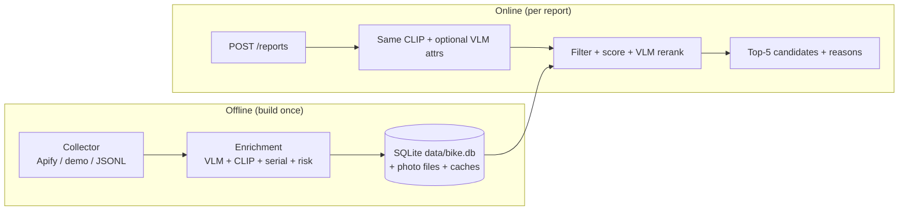

# Stolen Bike Matcher — Prototype Spec

> Single source of truth for **this repo as implemented**. Layout, SQLite schema, and API paths are fixed; do not invent parallel stores or live scraping on the online path.

---

## 1. Product summary

A user reports a stolen bike (photos + optional serial + theft date/location). The app compares the report against a **pre-collected, locally stored set of second-hand listings** (Marktplaats via a one-time Apify scrape) and returns a ranked list of **candidates for police review**, never accusations.

**Constraints**
- **No live scraping** on the online path. Listings are collected once and stored in SQLite + files.
- Every report is matched against that **fixed** corpus.
- `suspicion_score` is shown **separately** and is **never** part of the match score or ranking.

---

## 2. Architecture



Reports and listings share the same enrichment functions (`extract_attributes`, CLIP encode, serial helpers) so vectors and attributes are comparable.

---

## 3. Tech stack (as built)

| Concern | Implementation |
|---|---|
| Language | Python 3.11+ |
| Backend | FastAPI + Pydantic (`api/main.py`) |
| Database | SQLite `data/bike.db` (schema in `db.py`) |
| Vector search | In-memory brute-force numpy (`matching` uses listing `clip_vec` BLOBs; `ImageIndex` in `enrichment/embeddings.py`) — **not** FAISS / sqlite-vec |
| Image + text embeddings | Local `open_clip` (`ViT-B-32` / `laion2b_s34b_b79k`), L2-normalised float32 |
| Attributes + serial OCR + rerank | Vision LLM via **OpenRouter** (OpenAI-compatible) or **Gemini** if only `GOOGLE_API_KEY` is set; all calls go through `enrichment/llm_client.py` |
| Serial from text | Keyword-anchored regex, then VLM on photos |
| Frontend | Streamlit **form mockup only** (`app/streamlit_app.py`) — not wired to the API yet |
| Collection | One-time **Apify** actor `haketa/marktplaats-scraper`, or synthetic demo / JSONL import |

### Environment (`.env` / `.env.local`)

Secrets live in **`.env.local`** (gitignored). `.env.example` is the template.

```
OPENROUTER_API_KEY=...
OPENROUTER_BASE_URL=https://openrouter.ai/api/v1
# Fallback if OpenRouter key is unset:
# GOOGLE_API_KEY=...
# GEMINI_BASE_URL=https://generativelanguage.googleapis.com/v1beta/openai/
VLM_MODEL=qwen/qwen2.5-vl-72b-instruct   # or another OpenRouter / Gemini vision slug
CLIP_MODEL=ViT-B-32
CLIP_PRETRAINED=laion2b_s34b_b79k
LLM_TIMEOUT_S=60
DB_PATH=data/bike.db
API_URL=http://localhost:8000
APIFY_KEY=...                            # or APIFY_API_TOKEN
APIFY_MARKTPLAATS_ACTOR_ID=haketa/marktplaats-scraper
```

Tunables in `config.py` (not env): `MATCH_RADIUS_KM = 25`, `MATCH_WEIGHTS`, `RISK_WEIGHTS`, `VERIFY_TOP_K = 10`, `RESULT_TOP_K = 5`.

---

## 4. Repository layout

Repo root is this project (not a nested `bike-matcher/` folder).

```
stolen-fiets-scanner/
├── data/
│   ├── raw/listings.jsonl
│   ├── images/{listing_id}/          # listing photos (posix paths in DB)
│   ├── reports/{report_id}/          # intake JPEGs
│   ├── cache/llm/                    # VLM JSON cache (gitignored)
│   ├── cache/embeddings/text/        # CLIP text vectors as .npy (gitignored)
│   └── bike.db
├── collector/
│   ├── queries.yaml                  # Maastricht 6211, 25 km, fiets, cat 1655, max 300
│   ├── collect.py                    # --source apify|demo|jsonl
│   ├── apify_marktplaats.py
│   ├── relevance_filter.py
│   └── demo_corpus.py
├── enrichment/
│   ├── llm_client.py                 # sole VLM helper (retries, JSON, disk cache)
│   ├── attributes.py
│   ├── embeddings.py                 # CLIP + ImageIndex
│   ├── serial_ocr.py
│   ├── risk_signals.py
│   └── run_enrichment.py             # idempotent batch
├── matching/
│   ├── filters.py
│   ├── scorer.py
│   ├── verifier.py
│   └── explain.py
├── api/
│   ├── main.py
│   ├── schemas.py
│   └── routes/reports.py, listings.py
├── app/streamlit_app.py
├── eval/                             # stubs only (NotImplemented)
├── db.py
├── config.py
├── SPEC.md
└── README.md
```

---

## 5. Offline track

### 5.1 Collection (`collector/`)

`collector/queries.yaml` is a **targeted** plan: brands + types as search *intent*, region Maastricht postcode `6211`, radius **25 km**, query `fiets`, category `1655`, `max_listings: 300`. There is **no** €200–€500 price cap (listing-count cap instead).

```bash
python collector/collect.py --source apify    # requires APIFY_KEY in .env.local
python collector/collect.py --source demo
python collector/collect.py --import-jsonl path/to/dump.jsonl
```

- Dedupes by listing id, writes `data/raw/listings.jsonl` and photos under `data/images/{id}/`.
- `relevance_filter.py` drops parts, locks, accessories, kids’ bikes, and “gezocht”/wanted ads.
- Replaces SQLite listings via `replace_listings_from_jsonl` (does **not** live-crawl Marktplaats from the API).
- Current corpus after filter: **~235** listings (ids like `m2339783810`).

### 5.2 Enrichment (`enrichment/`)

```bash
python -m enrichment.run_enrichment            # all listings
python -m enrichment.run_enrichment --limit 5  # smoke
python -m enrichment.run_enrichment --only embeddings
```

Flags: `--force`, `--limit N`, `--only {attributes,embeddings,serial,risk}`. Each listing step is try/except + skip-if-done; progress every 25 rows.

**`attributes.py`** — VLM photos + description → Pydantic `BikeAttributes` (strict JSON). Parse failure: retry once in `llm_client`, then store nulls. Idempotent skip if `brand` already stored.

**`embeddings.py`** — local CLIP (first run downloads ~350MB weights). One L2-normalised vector per photo → `listing_images.clip_vec` / `report_images.clip_vec`. Description vectors **on disk** (`EMB_CACHE_DIR/text/{id}.npy`); **no** text-vector column. `ImageIndex.build_from_db` + `query()` is max cosine over any listing photo vs any query photo.

**`serial_ocr.py`** — `normalise_serial` (uppercase `[A-Z0-9]`). Text: keyword-anchored (`framenummer`, `serial`, …) then photos via VLM `{"serial": string|null}`. Writes **only** `listing_attributes.serial_found`.

**`risk_signals.py`** — local, no model. Score in `[0,1]` = `0.5` price-below-median (by `bike_type`, else global) + `0.35` fraction of suspicion phrases + `0.15` single-listing seller **proxy** (no real seller history). Phrases: *zonder papieren, geen bon, geen sleutel, snel weg, moet weg*. Overwrites `listings.suspicion_score`.

> ⚠️ `suspicion_score` is display-only and is **never** used in `matching/scorer.py`.

---

## 6. Data model (SQLite)

Unchanged from the original schema (`db.py` `SCHEMA_SQL`). Helpers: listings import, `insert_report` / `add_report_image` / `fetch_report`, `upsert_match` / `fetch_matches`, `fetch_listings_for_matching`.

```sql
-- listings, listing_images (path, clip_vec BLOB),
-- listing_attributes (JSON colors/accessories/marks, serial_found),
-- reports (no location column; lat/lon only),
-- report_images (path, clip_vec BLOB),
-- matches (score, serial_match, verdict, reasons JSON)
```

Image paths are posix and relative, e.g. `data/images/m2339783810/0.jpg`, `data/reports/r_abc12345/0.jpg`.

---

## 7. Online track

### 7.1 Report intake — `POST /reports`

Multipart: **1–5** photos (jpg/jpeg/png/webp), required `stolen_at` (ISO date/datetime). Optional: `location`, `stolen_lat`/`stolen_lon`, `serial`, `brand`, `color`, `notes`, `police_report_nr`.

- `report_id` = `r_` + 8 hex chars.
- Coords: explicit lat+lon, else **offline gazetteer** (Maastricht, Valkenburg, Meerssen, Heerlen, Sittard, Roermond, Genk, Hasselt, Liège, Aachen, Tongeren, Bilzen). Unknown city → null coords, **not** 422.
- Photos re-encoded RGB JPEG (strips EXIF/GPS).
- Always: CLIP image + text embed. VLM attributes are **best-effort** (missing key does not fail intake).
- Response `201` `{ "report_id": "r_..." }`.

### 7.2 Matching — three stages

**Stage 1 (`filters.py`)**
- Canonical serial: `normalise_serial` then OCR map `O→0`, `I/L→1`, `S→5`, `B→8`. Hits **bypass** other filters and pin to the front.
- Else drop if: parseable `posted_at` **before** `stolen_at`; **or** both sides have known `is_electric` and they disagree; **or** both have coords and haversine **> 25 km**. Missing fields → **keep** (conservative). Unparseable `posted_at` (e.g. Marktplaats `"Vandaag"`) does not drop.

**Stage 2 (`scorer.py`)** — do **not** renormalise missing modalities:

```
score = 0.45 × max image cosine
      + 0.30 × attribute agreement (brand, model, colour, frame, accessories, bike_type)
      + 0.15 × mark overlap
      + 0.10 × text cosine
```

Serial hit → `score = 1.0`. `suspicion_score` is not read.

**Stage 3 (`verifier.py`)** — VLM on top `VERIFY_TOP_K` (10). Serial hits skip VLM (`likely_same`, confidence 1). Sort: `likely_same` > `possibly_same` > no verdict > `different`, then Stage-2 score. Numeric `score` stays Stage-2.

**`explain.py`** — short strings: exact serial, shared brand/colour/frame/accessories, marks, verifier reasons, “posted N days after theft, K km away”.

Pipeline returns `RESULT_TOP_K` (5), serial hits first; rows persisted in `matches`. Missing VLM key: ranking still runs on image+text (+attributes if cached).

### 7.3 Results (API)

Top 5 JSON candidates: score, verdict, reasons, listing URL, **display** `suspicion_score`, first listing photo + first report photo. Streamlit does **not** render this yet.

---

## 8. API

| Method | Path | Status |
|---|---|---|
| `GET` | `/health` | `{status, listings}` |
| `GET` | `/listings/{id}` | Detail + attributes + image paths |
| `POST` | `/reports` | Multipart intake → `ReportCreated` (201) |
| `POST` | `/reports/{id}/match` | Run matcher → `MatchResponse` (404 if no report) |
| `GET` | `/reports/{id}/matches` | Cached matches (404 if none / unknown report) |

Candidate shape:

```json
{
  "report_id": "r_c7b4b2f1",
  "candidates": [
    {
      "listing_id": "m2339783810",
      "url": "https://...",
      "score": 0.73,
      "serial_match": false,
      "verdict": "likely_same",
      "reasons": ["strong photo similarity"],
      "suspicion_score": 0.15,
      "listing_image": "data/images/m2339783810/0.jpg",
      "report_image": "data/reports/r_c7b4b2f1/0.jpg"
    }
  ]
}
```

---

## 9. Evaluation (`eval/`)

`eval/make_test_reports.py` and `eval/evaluate.py` are **stubs** (`NotImplementedError`). Informal check used: held-out listing photo via `POST /reports` then `/match` (source listing in top 5); planted serial → `serial_match` true, score 1.0, `likely_same`.

---

## 10. Implementation status

| Item | Status |
|---|---|
| Layout, `requirements.txt`, `.env.example`, SQLite | Done |
| Collector (Apify + filter + ~235 listings) | Done |
| VLM attributes, CLIP + `ImageIndex` | Done |
| Serial OCR, risk, `run_enrichment` | Done |
| FastAPI `/health`, `/listings/{id}`, `POST /reports` | Done |
| Matcher + `/match` + cached `/matches` | Done |
| Streamlit results / API wiring | **Not done** (form mockup only) |
| Eval recall scripts | **Not done** |

---

## 11. Coding conventions

- Type hints; Pydantic for LLM JSON and API I/O.
- **All** VLM calls through `enrichment/llm_client.py` (timeout, retry, `parse_json_loose`, disk cache).
- Cache embeddings (SQLite BLOBs / `.npy`) and LLM outputs — do not silently re-pay.
- Batch jobs idempotent; log skip/done counts.
- Config in `config.py` + dotenv. No secrets in git. No online scraping.
- Small functions and `__main__` smoke blocks on enrichment/matching modules.

---

## 12. Costs, ethics, legal

- CLIP is local (one-time weight download). VLM cost is OpenRouter/Gemini usage (attributes, serial OCR, pairwise verify). Disk cache avoids repeats.
- Many city bikes look alike; serial + marks + VLM matter more than CLIP alone. Only a subset of listings may have CLIP/VLM rows until `run_enrichment` is run on the full set.
- Candidates for police review — do not confront sellers. Minimal seller fields; delete demo data after use.
- Collection is small, one-shot, via Apify — not a Marktplaats site crawl from this app.
